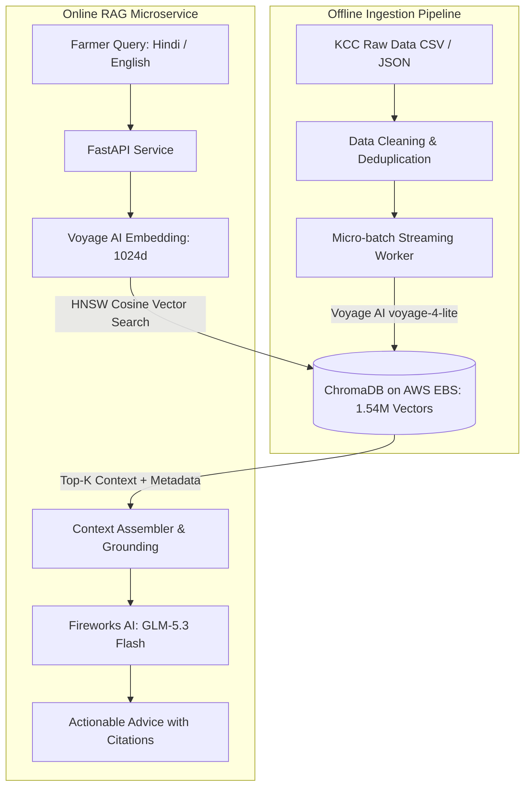

# 🌾 KisanMitra (किसान मित्र)

**KisanMitra** is an AI-powered agricultural advisory system for Indian farmers. It leverages over **1.54 Million real-world Kisan Call Centre (KCC) farmer-expert advisory logs** to provide hyper-localized, fact-grounded recommendations for pest control, plant diseases, fertilizer dosages, crop varieties, and government schemes in both Hindi and English.

---

## ⚡ System Architecture



---

## 📊 Benchmark Results

Verified directly on AWS EC2 across **1,541,253 embedded KCC records**:

| Metric | Result | Notes |
| :--- | :--- | :--- |
| **Indexed Records** | **1,541,253** | 100% indexed in ChromaDB on EBS |
| **Retrieval Latency (P50)** | **123.2 ms** | Includes Voyage API embedding + Chroma search |
| **Retrieval Latency (P95)** | **136.3 ms** | Sub-150ms tail latency |
| **Mean Top-1 Score** | **0.634** (Peak: **0.727**) | Strong semantic separation |
| **Test Case Pass Rate** | **20 / 20 (100%)** | Pests, Diseases, Nutrients, Varieties, Schemes |
| **Generation Model** | **GLM-5.3 Flash** | Via Fireworks AI with inline citations `[1]`, `[2]` |
| **Time-to-First-Token** | **~250 ms** | Via `/chat/stream` SSE endpoint |

---

## 📁 Repository Structure

```text
kisanmitra/
├── Ingestion/                     # Data cleaning and ingestion scripts
│   ├── clean_kcc_data.py          # Cleans and formats raw KCC call records
│   ├── ingest_kcc.py              # Generates JSONL batches for KCC records
│   ├── ingest_books.py            # Extracts and chunks agricultural books & PDFs
│   └── run_ingestion.py           # Ingestion orchestrator
│
├── embedding-pipeline/            # High-throughput embedding & storage pipeline
│   ├── client/                    # Streaming JSONL reader with auto-retry & checkpoints
│   │   ├── worker.py              # Micro-batching worker client
│   │   ├── retry.py               # Exponential backoff and fault-tolerant sender
│   │   └── checkpoint.py          # Checkpoint manager to resume on interruption
│   └── server/                    # Dedicated embedding server
│       ├── model.py               # Voyage AI embedding integration
│       └── database.py            # ChromaDB PersistentClient manager
│
├── rag-api/                       # Production FastAPI RAG microservice
│   ├── app/
│   │   ├── main.py                # FastAPI endpoints (/health, /search, /chat, /chat/stream)
│   │   ├── config.py              # Environment configuration
│   │   ├── schemas.py             # Pydantic request/response schemas
│   │   └── rag/
│   │       ├── embeddings.py      # Voyage AI query embedding wrapper
│   │       ├── vectorstore.py     # ChromaDB manager with startup RAM warmup
│   │       └── chain.py           # LangChain RAG pipeline with Fireworks AI
│   ├── deploy/
│   │   └── kisanmitra-rag.service # Systemd production unit file
│   ├── scripts/
│   │   ├── benchmark.py           # 20-case automated benchmark suite
│   │   └── eval_retrieval.py      # Rapid retrieval evaluation script
│   └── README.md                  # Detailed API and benchmark documentation
│
└── requirements.txt               # Top-level dependencies
```

---

## 🚀 Quickstart

### 1. Run the RAG API
```bash
cd rag-api
python3.11 -m venv venv
source venv/bin/activate
pip install -r requirements.txt

# Configure .env (VOYAGE_API_KEY, FIREWORKS_API_KEY, CHROMA_PATH)
cp .env.example .env

# Start server
uvicorn app.main:app --host 0.0.0.0 --port 8080 --workers 1
```

### 2. Run the Benchmark Suite
```bash
# Test retrieval latency only
python scripts/benchmark.py --url http://localhost:8080 --k 4

# Test full end-to-end RAG with Fireworks Llama 3.3 70B
python scripts/benchmark.py --url http://localhost:8080 --chat --k 4
```

---

## 📜 License
MIT License.
