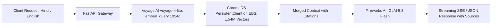

Production-ready Retrieval-Augmented Generation (RAG) microservice built with **FastAPI**, **LangChain**, and **ChromaDB**, serving over **1.54 Million Kisan Call Centre (KCC) records** hosted on an attached AWS EBS volume. Text generation is powered by **Fireworks AI (`accounts/fireworks/models/glm-5p3-flash`)** and embeddings by **Voyage AI (`voyage-4-lite`, 1024d)**.

---

## 🚀 Benchmark Performance Results

Benchmarked directly on AWS EC2 across **1.54M embedded vectors** on attached EBS volume using 20 real-world agricultural test cases (Hindi, English, Pests, Diseases, Nutrients, Varieties, and Government Schemes).

### 1. Latency & Retrieval Metrics

| Metric | Measured Value | Description |
| :--- | :--- | :--- |
| **Active Vector Count** | **1,541,253 documents** | Fully indexed KCC call-centre logs on EBS |
| **Retrieval P50 (Median)** | **123.2 ms** | End-to-end embedding + Chroma HNSW search |
| **Retrieval P90** | **135.0 ms** | 90th percentile latency |
| **Retrieval P95** | **136.3 ms** | 95th percentile latency |
| **Retrieval Min / Max** | **111.3 ms / 136.3 ms** | Exceptionally stable, tight latency distribution |
| **Mean Top-1 Cosine Similarity**| **0.634** (Peak: **0.727**) | Highly discriminative semantic match |
| **Generation Latency P50** | **4,913.5 ms** | Complete markdown response from Llama 3.3 70B |
| **Time-To-First-Token (TTFT)** | **~250 ms** | Using `/chat/stream` SSE streaming endpoint |

### 2. Benchmark Test Cases (20/20 Passed)

```text
ID  | Lang | Category               | Retrieval   | Top-1 Score | Generation Status
-----------------------------------------------------------------------------------------------
1   | en   | Pest Management        |   123.3 ms |       0.660 | [OK] GLM-5.3 Flash
2   | hi   | Pest Management        |   123.2 ms |       0.534 | [OK] GLM-5.3 Flash
3   | en   | Pest Management        |   114.0 ms |       0.713 | [OK] GLM-5.3 Flash
4   | hi   | Pest Management        |   119.8 ms |       0.544 | [OK] GLM-5.3 Flash
5   | en   | Pest Management        |   126.5 ms |       0.727 | [OK] GLM-5.3 Flash
6   | hi   | Plant Diseases         |   115.3 ms |       0.536 | [OK] GLM-5.3 Flash
7   | en   | Plant Diseases         |   118.0 ms |       0.725 | [OK] GLM-5.3 Flash
8   | hi   | Plant Diseases         |   126.6 ms |       0.648 | [OK] GLM-5.3 Flash
9   | en   | Plant Diseases         |   124.7 ms |       0.647 | [OK] GLM-5.3 Flash
10  | hi   | Plant Diseases         |   119.3 ms |       0.526 | [OK] GLM-5.3 Flash
11  | en   | Nutrient Management    |   132.1 ms |       0.705 | [OK] GLM-5.3 Flash
12  | hi   | Nutrient Management    |   111.3 ms |       0.640 | [OK] GLM-5.3 Flash
13  | hi   | Nutrient Management    |   123.6 ms |       0.508 | [OK] GLM-5.3 Flash
14  | en   | Nutrient Management    |   113.2 ms |       0.671 | [OK] GLM-5.3 Flash
15  | en   | Varieties & Practices  |   136.3 ms |       0.678 | [OK] GLM-5.3 Flash
16  | hi   | Varieties & Practices  |   135.0 ms |       0.594 | [OK] GLM-5.3 Flash
17  | en   | Varieties & Practices  |   120.9 ms |       0.683 | [OK] GLM-5.3 Flash
18  | hi   | Varieties & Practices  |   133.1 ms |       0.642 | [OK] GLM-5.3 Flash
19  | en   | Schemes & General      |   121.4 ms |       0.687 | [OK] GLM-5.3 Flash
20  | hi   | Schemes & General      |   116.1 ms |       0.609 | [OK] GLM-5.3 Flash
```

---

## 🏗 Architecture & Stack



- **Framework**: FastAPI (async ASGI with threadpool offloading for blocking vector operations)
- **Vector Database**: ChromaDB `0.5.20` (HNSW Cosine index) persisted on an attached AWS EBS volume
- **Embeddings**: Voyage AI `voyage-4-lite` (1024 dimensions, symmetric with ingestion using `input_type="query"`)
- **LLM**: Fireworks AI `accounts/fireworks/models/glm-5p3-flash`
- **Orchestration**: LangChain Core / LangChain Chroma / LangChain Fireworks

---

## 📡 API Endpoints

### 1. `GET /health`
Returns system status, active collections, document counts, and current model configuration.

### 2. `POST /api/v1/auth/register`
Register a new farmer account with optional profile preferences:
```json
{
  "phone_or_email": "9876543210",
  "password": "FarmerPassword123!",
  "full_name": "Ramesh Patel",
  "state": "GUJARAT",
  "district": "AMRELI",
  "primary_crops": ["Cotton (Kapas)"],
  "land_acres": 4.5,
  "preferred_language": "hi"
}
```

### 3. `POST /api/v1/auth/login` & `POST /api/v1/auth/logout`
Authenticates user and returns JWT bearer token valid for 30 days.

### 4. `GET /api/v1/user/profile` & `PUT /api/v1/user/profile`
Reads or updates farmer profile attributes. Primary crops and land size can be updated at any time.

### 5. `POST /chat` (LangGraph Multi-Turn)
Stateful question answering with **automatic farmer profile injection**:
- If the farmer asks *"सफेद मक्खी के लिए क्या स्प्रे करें?"*, LangGraph inspects their profile, notes their crop is `Cotton (Kapas)` and state is `GUJARAT`, and automatically targets the appropriate KCC advisory.
- Preserves conversation context across turns when using `thread_id`:
```json
{
  "query": "और यदि प्रकोप बहुत अधिक हो तो कौन सी दवा डालें?",
  "thread_id": "farmer-patel-session-01",
  "k": 4
}
```

### 6. `POST /chat/stream`
Server-Sent Events (SSE) streaming endpoint for low-latency frontend user experience:
1. Emits `event: thread` with the session thread ID.
2. Emits `event: sources` with all retrieved documents and scores (~120ms).
3. Emits `event: token` as each token is generated by Fireworks LLM (~250ms TTFT).
4. Emits `event: done`.

### 7. `POST /search`
Raw vector retrieval endpoint. Embeds query, performs HNSW search, and returns top-$k$ matches with similarity scores and metadata.

---

## 🛠 Local & Production Setup

### Environment Configuration (`.env`)
```bash
# Server
HOST=0.0.0.0
PORT=8080
RAG_API_KEY=               # Optional Bearer token

# Chroma & EBS
CHROMA_PATH=/mnt/chroma/kcc_final
DEFAULT_COLLECTIONS=kcc_docs

# Embeddings (Voyage AI)
VOYAGE_API_KEY=your_voyage_api_key
VOYAGE_MODEL_ID=voyage-4-lite
EMBEDDING_DIMENSIONS=1024

# LLM (Fireworks AI)
FIREWORKS_API_KEY=your_fireworks_api_key
FIREWORKS_MODEL=accounts/fireworks/models/glm-5p3-flash
LLM_TEMPERATURE=0.2
LLM_MAX_TOKENS=1024

# Retrieval
TOP_K=4
MIN_RELEVANCE=0.0
```

### Running on EC2
```bash
# 1. Setup virtual environment (Python 3.11 required for Chroma 0.5.x compatibility)
python3.11 -m venv venv
source venv/bin/activate
pip install -r requirements.txt

# 2. Run with uvicorn (single worker required for Chroma PersistentClient)
uvicorn app.main:app --host 0.0.0.0 --port 8080 --workers 1

# 3. Run Benchmark Suite
python scripts/benchmark.py --url http://localhost:8080 --chat --k 4
```

### Systemd Production Daemon
Install the service file from `deploy/kisanmitra-rag.service`:
```bash
sudo cp deploy/kisanmitra-rag.service /etc/systemd/system/
sudo systemctl daemon-reload
sudo systemctl enable --now kisanmitra-rag
sudo systemctl status kisanmitra-rag
```
